# Age of Empires II: The Conquerors en Wine (Kubuntu 26.04)

Guia completa para instalar y ejecutar Age of Empires II: The Conquerors Expansión en Linux usando Wine, con soporte widescreen 1920x1080 y todas las correcciones necesarias para Kubuntu 26.04 LTS.

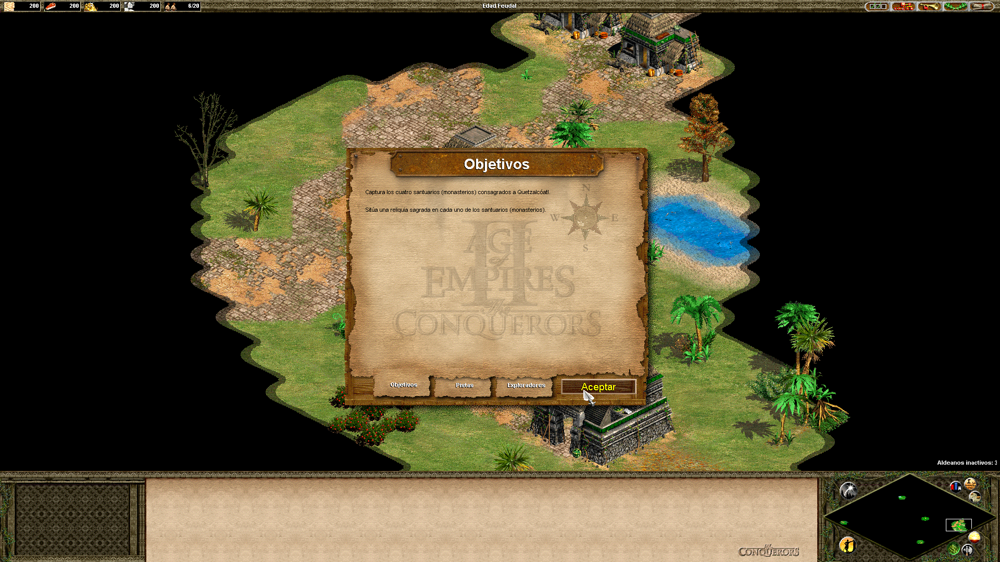

## Estado: Funcionando

| Componente | Estado |
|------------|--------|
| SO | Kubuntu 26.04 LTS (resolute), kernel 7.0, Plasma 6.6.4 (Wayland) |
| Wine | 11.0 stable (wow64) |
| Juego | Age of Empires II + The Conquerors 1.0C |
| UserPatch | v1.5 Build 6268 |
| cnc-ddraw | Ultimo release |
| Resolución | 1920x1080 (16:9 widescreen) |
| Videos intro | Funcionando (audio + video) |
| Campanas | Todas accesibles (sin mensaje de CD) |
| Idioma | Espanol |

## Capturas de pantalla

### Menu principal en widescreen
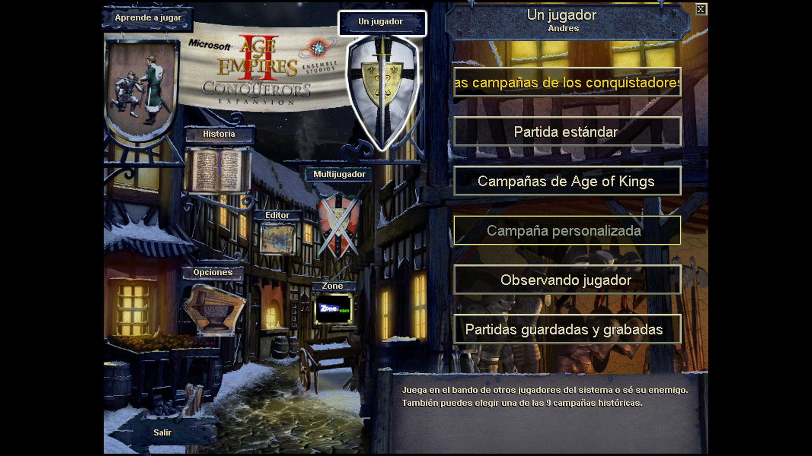

### Campanas funcionando sin CD
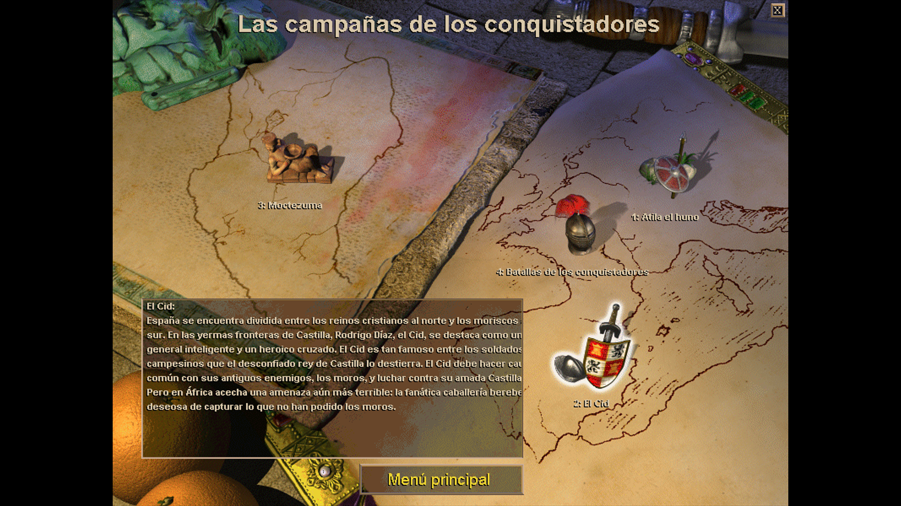
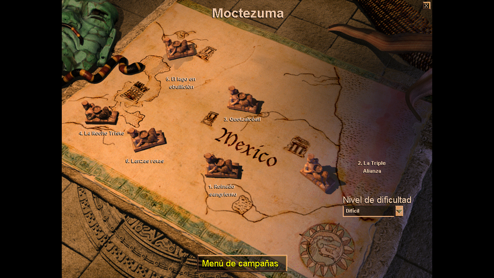

### Gameplay en 1920x1080

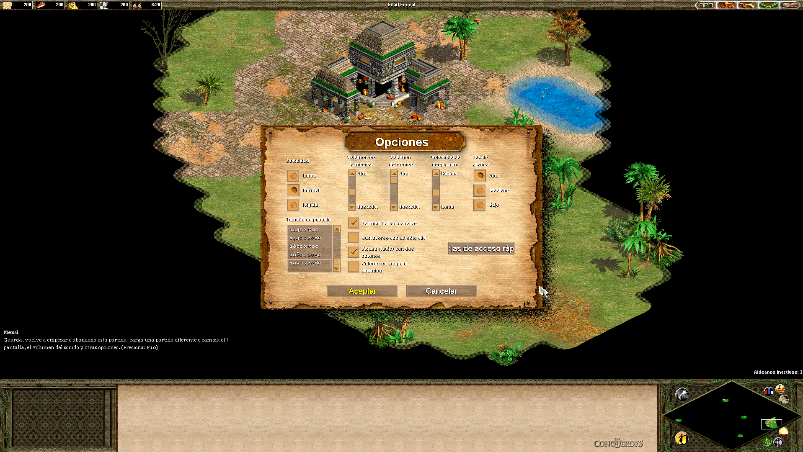

### Videos de introducción
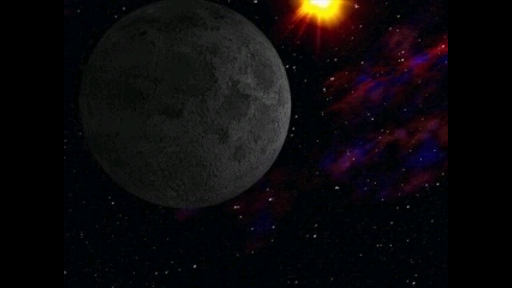

### UserPatch v1.5 - Instalador
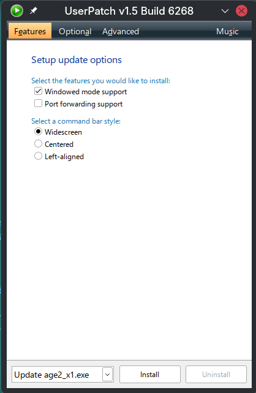
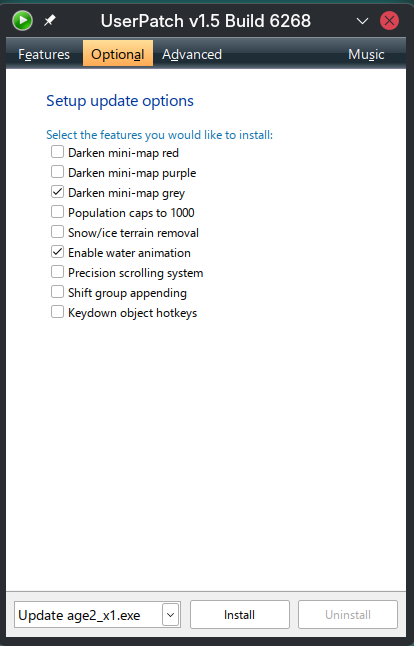
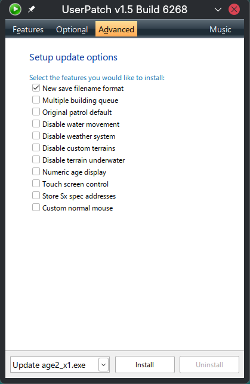
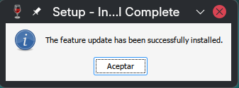

### Errores resueltos
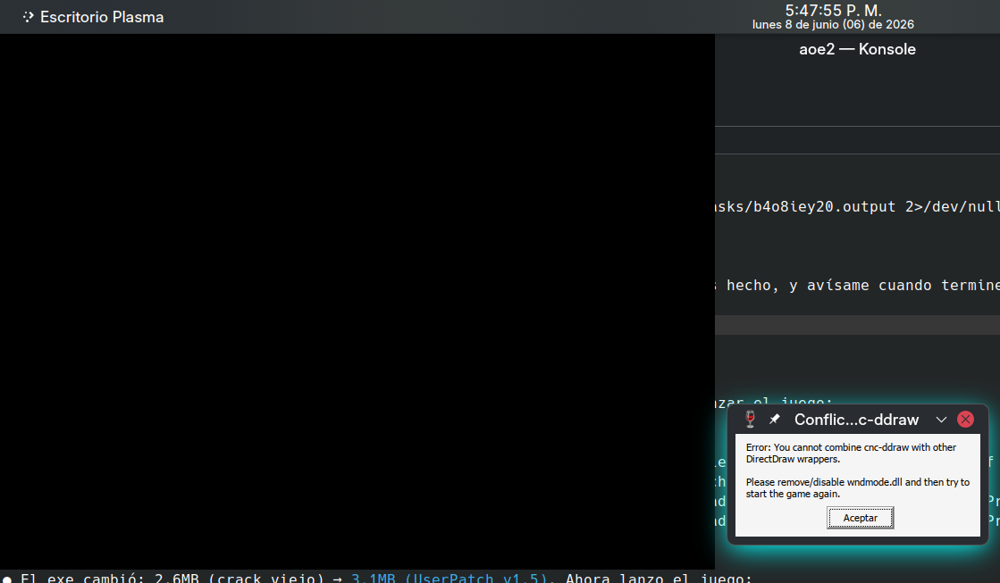
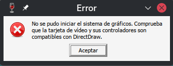

---

## Requisitos

- Kubuntu 26.04 LTS (o Ubuntu 26.04+)
- Wine 11.0 stable desde [WineHQ](https://dl.winehq.org/wine-builds/ubuntu/)
- winetricks
- Archivos del juego Age of Empires II + The Conquerors Expansión 1.0C

## Instalación paso a paso

### 1. Instalar Wine 11.0 stable

```bash
# Agregar repositorio WineHQ para Ubuntu 26.04 (resolute)
sudo tee /etc/apt/sources.list.d/winehq-resolute.sources << 'EOF'
Types: deb
URIs: https://dl.winehq.org/wine-builds/ubuntu
Suites: resolute
Components: main
Architectures: amd64 i386
Signed-By: /etc/apt/keyrings/winehq-archive.key
EOF

sudo apt update
sudo apt install winehq-stable winetricks
```

### 2. Crear prefijo Wine

```bash
PREFIX="$HOME/Juegos/Instalados/Age of Empires II"

# IMPORTANTE: Wine 11.0 en resolute usa wow64 obligatorio
# NO usar WINEARCH=win32 (no soportado)
WINEPREFIX="$PREFIX" wineboot --init
```

> **Nota critica:** Wine 11.0 en Ubuntu 26.04 compila solo con soporte wow64.
> Los prefijos win32 puros ya no son soportados. Los ejecutables 32-bit
> corren via WoW64 (Windows on Windows 64-bit) dentro de un prefijo win64.

### 3. Copiar archivos del juego

```bash
GAME="$PREFIX/drive_c/Program Files (x86)/Microsoft Games/Age of Empires II"
mkdir -p "$GAME"
# Copiar todo el contenido del juego instalado a $GAME
# Incluye: age2_x1/, Data/, Sound/, Campaign/, AI/, etc.
```

> En un prefijo win64, los programas 32-bit van en `Program Files (x86)`,
> no en `Program Files`.

### 4. Configurar Windows y registro

```bash
export WINEPREFIX="$PREFIX" WINEDEBUG=-all

# Windows 2000 (recomendado para compatibilidad con juegos clasicos)
wine reg add "HKCU\Software\Wine" /v Versión /t REG_SZ /d win2k /f

# DirectDraw config + CSMT off
wine reg add "HKCU\Software\Wine\DllOverrides" /v ddraw /t REG_SZ /d native /f
wine reg add "HKCU\Software\Wine\Direct3D" /v directdrawrenderer /t REG_SZ /d gdi /f
wine reg add "HKCU\Software\Wine\Direct3D" /v OffscreenRenderingMode /t REG_SZ /d backbuffer /f
wine reg add "HKCU\Software\Wine\Direct3D" /v csmt /t REG_DWORD /d 0 /f

# Registrar instalación del juego
wine reg add "HKLM\Software\Microsoft\Microsoft Games\Age of Empires\2.0" \
  /v "EXE Path" /t REG_SZ /d "C:\Program Files (x86)\Microsoft Games\Age of Empires II" /f
wine reg add "HKLM\Software\Microsoft\Microsoft Games\Age of Empires\2.0" \
  /v InstallationDirectory /t REG_SZ \
  /d "C:\Program Files (x86)\Microsoft Games\Age of Empires II" /f
wine reg add "HKLM\Software\Microsoft\Microsoft Games\Age of Empires\2.0" \
  /v Versión /t REG_SZ /d "2.0a" /f
wine reg add "HKLM\Software\Microsoft\Microsoft Games\Age of Empires\2.0" \
  /v LangID /t REG_DWORD /d 10 /f
wine reg add \
  "HKLM\Software\Microsoft\Microsoft Games\Age of Empires II: The Conquerors Expansión\1.0" \
  /v "EXE Path" /t REG_SZ /d "C:\Program Files (x86)\Microsoft Games\Age of Empires II" /f
wine reg add \
  "HKLM\Software\Microsoft\Microsoft Games\Age of Empires II: The Conquerors Expansión\1.0" \
  /v Versión /t REG_SZ /d "1.0C" /f
wine reg add \
  "HKLM\Software\Microsoft\Microsoft Games\Age of Empires II: The Conquerors Expansión\1.0" \
  /v LangID /t REG_DWORD /d 10 /f
```

### 5. Instalar dependencias con winetricks

```bash
WINEPREFIX="$PREFIX" winetricks -q quartz devenum directmusic dsound cinepak icodecs
```

| Componente | Función |
|------------|---------|
| quartz | DirectShow (reproducción de video) |
| devenum | Enumeración de dispositivos multimedia |
| directmusic | Musica MIDI del juego |
| dsound | DirectSound (efectos de sonido) |
| cinepak | Codec Cinepak (videos) |
| icodecs | Intel Indeo 5 (video intro) |

> **Nota:** `amstream` puede fallar en wow64 con error al registrar DLL.
> No es critico para el funcionamiento del juego.

### 6. Instalar cnc-ddraw

[cnc-ddraw](https://github.com/FunkyFr3sh/cnc-ddraw) reemplaza el DirectDraw
de Wine con un renderer OpenGL moderno. Resuelve freezes en Alt+Tab, pantalla
negra con compositores de ventana, y problemas de mouse.

```bash
GAME="$PREFIX/drive_c/Program Files (x86)/Microsoft Games/Age of Empires II"

# Descargar
curl -sL -o /tmp/cnc-ddraw.zip \
  https://github.com/FunkyFr3sh/cnc-ddraw/releases/latest/download/cnc-ddraw.zip

# Extraer en carpeta del juego
unzip -o /tmp/cnc-ddraw.zip ddraw.dll "cnc-ddraw config.exe" Shaders/* -d "$GAME/"

# CRITICO: copiar ddraw.dll al subdirectorio del exe
cp "$GAME/ddraw.dll" "$GAME/age2_x1/ddraw.dll"
```

Crear `ddraw.ini` en la carpeta del juego y en `age2_x1/`:

```ini
[age2_x1]
nonexclusive=true
adjmouse=true
noactivateapp=true
windowed=true
fullscreen=true
toggle_borderless=true
renderer=opengl
maintas=true
```

```bash
cp "$GAME/ddraw.ini" "$GAME/age2_x1/ddraw.ini"
```

### 7. Instalar UserPatch v1.5 (OBLIGATORIO)

[UserPatch v1.5](https://userpatch.aiscripters.net/) es un parche de la
comunidad que corrige bugs, agrega soporte widescreen, y -- critico para
Wine wow64 -- **elimina el CD check** internamente.

```bash
# Descargar
curl -sL -o /tmp/UserPatch.zip \
  "http://userpatch.aiscripters.net/UserPatch.v1.5.20190228-000000.zip"

# Extraer SetupAoC.exe
unzip -o /tmp/UserPatch.zip "UserPatch/SetupAoC.exe" -d /tmp/

# Copiar al directorio del juego
cp /tmp/UserPatch/SetupAoC.exe "$GAME/SetupAoC.exe"

# Ejecutar instalador
cd "$GAME" && WINEPREFIX="$PREFIX" wine SetupAoC.exe
```

Opciones recomendadas:
- **Features:** Windowed mode support + Widescreen
- **Optional:** Darken mini-map grey + Enable water animation
- **Advanced:** New save filename format

Despues de instalar, **eliminar wndmode.dll**:

```bash
rm "$GAME/age2_x1/wndmode.dll"
```

> **Por que:** UserPatch instala `wndmode.dll` para su propio modo ventana.
> Esto conflicta con cnc-ddraw ("You cannot combine cnc-ddraw with other
> DirectDraw wrappers"). cnc-ddraw es superior para Linux.

### 8. Crear launcher

Crear `launch-aoe2.sh` en la raiz del WINEPREFIX:

```bash
#!/bin/bash
export WINEPREFIX="$HOME/Juegos/Instalados/Age of Empires II"
export WINEDLLOVERRIDES="mscoree,mshtml="
export WINEDEBUG=-all

GAME_DIR="$WINEPREFIX/drive_c/Program Files (x86)/Microsoft Games/Age of Empires II"

cd "$GAME_DIR" || exit 1
wine age2_x1/age2_x1.exe "$@"
wineserver --wait
```

```bash
chmod +x launch-aoe2.sh
```

### 9. Crear lanzador .desktop (KDE/GNOME)

```ini
[Desktop Entry]
Name=Age of Empires II - The Conquerors
Comment=Juego de estrategia en tiempo real
Exec="/home/USER/Juegos/Instalados/Age of Empires II/launch-aoe2.sh"
Icon=/home/USER/Juegos/Instalados/Age of Empires II/icon.png
Terminal=false
Type=Application
Categories=Game;StrategyGame;
Keywords=aoe;age;empires;strategy;rts;
StartupNotify=false
```

## Por que UserPatch es obligatorio en Wine wow64

Los No-CD cracks clasicos (circa 2008) hookean `GetDriveTypeA` a nivel 32-bit
para devolver `DRIVE_CDROM`. En Wine wow64, la llamada pasa por thunking
32->64 bits y **el hook no intercepta correctamente**. No hay fix posible
para cracks viejos en wow64.

UserPatch v1.5 reemplaza el ejecutable completo con su propia versión
parcheada que **no tiene CD check**. Es la unica solución estable para
Wine wow64.

### Soluciones intentadas que NO funcionan en wow64

| Solución | Por que falla |
|----------|---------------|
| No-CD crack 2008 (2.6MB) | Hook de GetDriveTypeA bypaseado por thunking 32->64 |
| Registry CDPath=D:\ + symlink | GetDriveTypeA sigue devolviendo DRIVE_FIXED |
| D: como cdrom en Wine registry | El juego verifica más que solo el tipo de drive |
| CDPath=. (directorio actual) | El check de CD sigue activo en el exe |
| Exe original (346KB) + cdrom config | Page fault -- necesita CD real |
| Windows 2000 compatibility | No afecta el mecanismo de CD check |

## Hotkeys

| Hotkey | Acción |
|--------|--------|
| Alt+Enter | Alternar ventana/borderless (cnc-ddraw) |
| Ctrl+Tab | Liberar cursor (cnc-ddraw) |
| Alt+PageDown | Maximizar ventana (cnc-ddraw) |
| Ctrl+F12 | Captura de mapa en alta resolución (UserPatch) |

## Troubleshooting

| Problema | Causa | Solución |
|----------|-------|----------|
| "Insertar CD" | No-CD no funciona en wow64 | Instalar UserPatch v1.5 |
| "Cannot combine cnc-ddraw with other wrappers" | wndmode.dll presente | `rm age2_x1/wndmode.dll` |
| "No se pudo iniciar sistema de graficos" | wndmode.dll + cnc-ddraw | Eliminar wndmode.dll |
| `DDRAW.dll not found` | Falta ddraw.dll en age2_x1/ | Copiar ddraw.dll al subdirectorio |
| Freeze en Alt+Tab | Fullscreen exclusivo | cnc-ddraw borderless mode |
| Pantalla negra | Compositor interfiere | cnc-ddraw `renderer=opengl` |
| Mouse desplazado | Resolución sin ajuste | cnc-ddraw `adjmouse=true` |
| Sin sonido/musica | Dependencias faltantes | `winetricks dsound directmusic` |
| Videos oscuros (audio pero sin imagen) | Codecs faltantes | `winetricks cinepak icodecs quartz devenum` |
| `WINEARCH win32 not supported` | Wine wow64 | No usar WINEARCH=win32 |
| `kernel32.dll not found` | Prefijo win32 en wow64 | Recrear con `wineboot --init` |
| `Mismatched architecture` | .reg con #arch=win32 | Cambiar a `#arch=win64` en todos los .reg |

## Migración desde Kubuntu 24.04

Si vienes de una instalación en Kubuntu 24.04 con prefijo win32:

1. El prefijo win32 **NO es compatible** con Wine wow64 -- hay que recrearlo
2. Crear prefijo nuevo win64 con `wineboot --init`
3. Copiar solo los archivos del juego (no .reg ni dosdevices del backup)
4. La ruta cambia de `Program Files` a `Program Files (x86)`
5. Aplicar toda la configuración de registro desde cero
6. Instalar winetricks + cnc-ddraw + UserPatch
7. Eliminar wndmode.dll
8. Recrear launch-aoe2.sh y .desktop

## Creditos

- [UserPatch v1.5](https://userpatch.aiscripters.net/) por ScriptSol/AIscripters
- [cnc-ddraw](https://github.com/FunkyFr3sh/cnc-ddraw) por FunkyFr3sh
- [WineHQ](https://www.winehq.org/) por el proyecto Wine
- [PCGamingWiki](https://www.pcgamingwiki.com/wiki/Age_of_Empires_II:_The_Age_of_Kings) por documentación de fixes
- [Arch Linux Forums](https://bbs.archlinux.org/viewtopic.php?id=129454) por soluciones de Wine

## Licencia

Esta guia es de uso libre. El juego Age of Empires II es propiedad de Microsoft/Xbox Game Studios.
